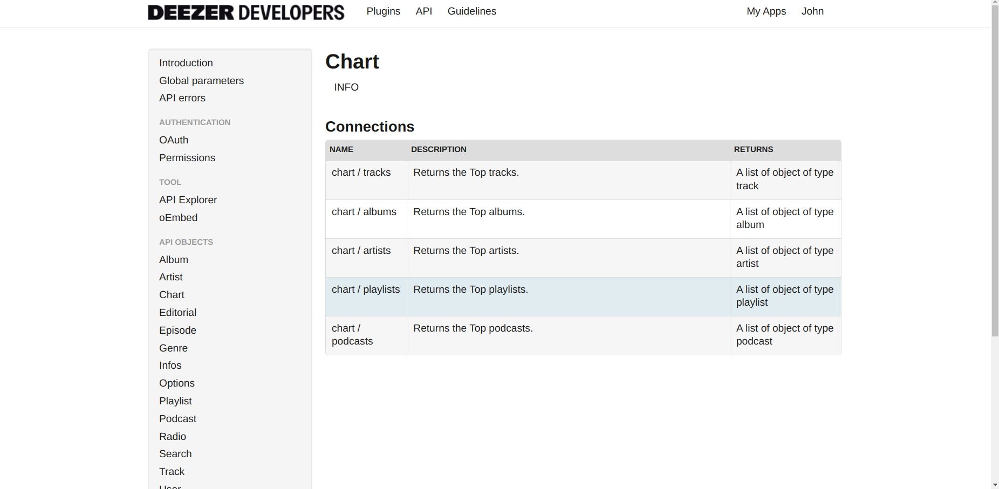

# Desafio Técnico

Escolhi a API do Deezer para criar a integração.



```
https://developers.deezer.com/api/
```

## Etapas para executar o projeto

### 1. Configurar o Proxy para CORS

Clone o repositório cors-anywhere para permitir chamadas à API Deezer sem restrições de CORS:

```
git clone https://github.com/Rob--W/cors-anywhere.git
```

Entre no diretório do projeto e inicie o servidor:

```
cd cors-anywhere
yarn
yarn start
```

### 2. Clonar e Executar o Projeto Principal

```
git clone https://github.com/johnanderx/web-artists.git
```

Entre no diretório do projeto:

```
cd web-artists
```

Instale as dependências e execute o projeto:

```
yarn
yarn dev
```

Vídeo de demonstração: <a href='https://drive.google.com/file/d/1m4SzmBIPs627OBIpBwtdLqVGrW2PvZNX/view?usp=drive_link'>Vídeo<a/>
